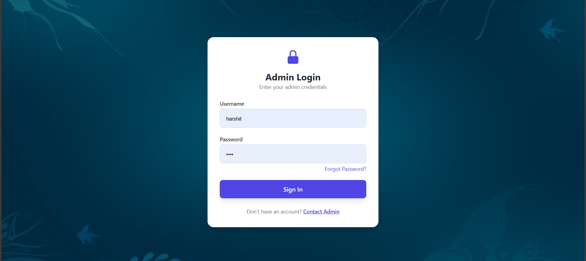
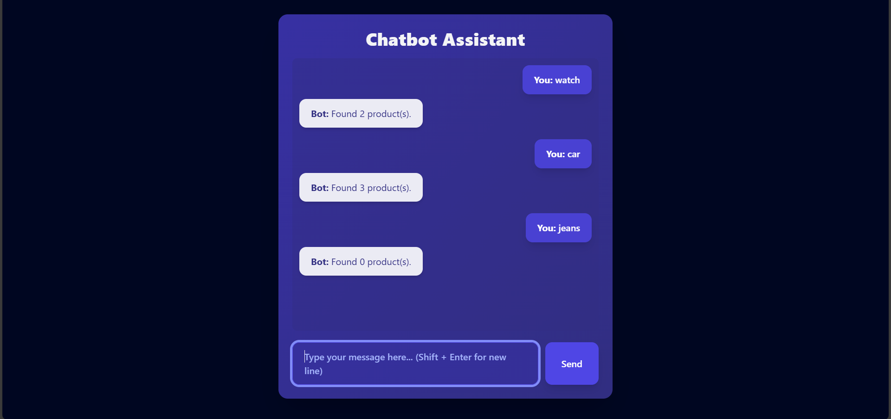

# ecom chatbot

This project consists of two parts:

- **Backend:** Django 3.0.5 with Django REST Framework and django-import-export for product import/export
- **Frontend:** React app using Vite, Tailwind CSS, axios for API calls, and Heroicons for UI icons
- ## 🖼️ Preview

### 🔐 Login UI



---

### 🛍️ ChatBot UI



---

---

## Backend (Django) Setup

### Technologies Used

- Django 3.0.5
- Django REST Framework
- django-import-export v2.5.0 (compatible with Django 3.0.5)

### Steps to Setup Backend

1. **Create and activate a virtual environment**

```bash
# Windows
python -m venv venv
venv\Scripts\activate

# macOS/Linux
python -m venv env
source env/bin/activate
```
2. **Create Superuser for admin and perform m igrations then run the server**
   > Have alredy created one superuser admin for which :- Username - harshit ,  Password - 1234
```bash
python manage.py createsuperuser
python manage.py makemigrations
python manage.py migrate
python manage.py runserver
   ```

### Steps to Setup Frontend

### Technologies Used

> React (via Vite)

> Tailwind CSS

> Axios

> @heroicons/react

1. **Create React app using Vite and installing node modules**
   ```bash
   npm create vite@latest projectname
   cd projectname
   npm install
   ```
2. **Install dependencies**
   ```bash
   npm install axios @heroicons/react
   npm install -D tailwindcss postcss autoprefixer
   npx tailwindcss init -p
   ```
3. **Configure Tailwind CSS**
https://v3.tailwindcss.com/docs/guides/vite

4. **Run the React development server**
   ```bash
   npm run dev
   ```
